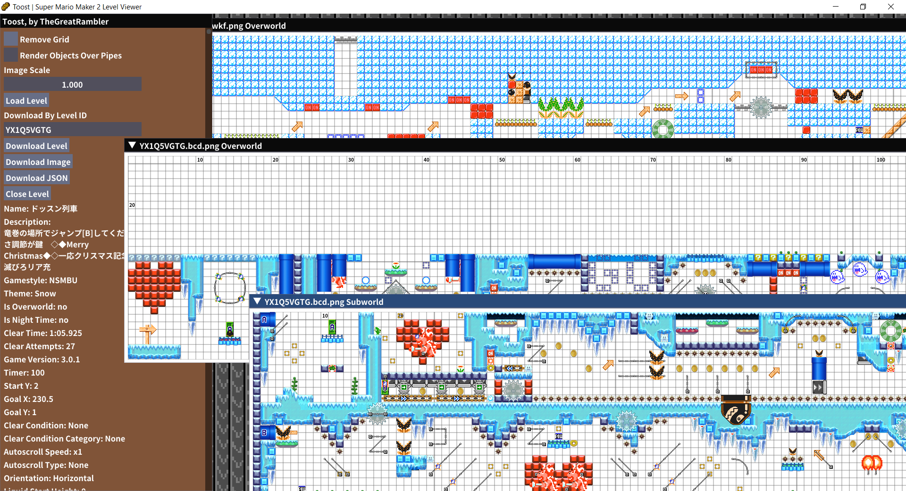

# Toost

Level viewer for Super Mario Maker 2, based on [JiXiaomai's work](https://github.com/JiXiaomai/SMM2LevelViewer). Hosted live at [https://tgrcode.com/level_viewer/](https://tgrcode.com/level_viewer/)!



# Usage
To load a local level file, press `Load Level` and choose a level. Wait a few seconds and the level will be rendered for you, along with some info. To load a level from a course ID, type your course ID into the textbox and press `Download Level`. As before, wait a few seconds and the level will be rendered. The rendered levels can be dragged with your mouse. You can also download them with `Download Image`, export info in JSON with `Download JSON`, or close the window to free up space with the `x` in the top left or with `Close Level`. To render levels without the grid, check `Remove Grid` and to render objects over pipes check `Render Objects Over Pipes`. You may also change the size of the image with `Image Scale`.

# How to build
If building for desktop, obtain development files for `sdl2`, `glew`, `glfw3`, `zlib`, `cairo`, `freetype2`, and `libcurl`, as well as having an up to date GCC and pkg-config. Compilation on Windows should use MSYS2, on Mac should use homebrew and on linux should use standard GCC. Type `make` for a debug build and `make BUILD=release` for a release build.
If building for web, first obtain a working Emscripten build environment and put its binaries on the path, such as `emmake`, `emcc` and `em++`. Next, run `./prepare_web_deps.sh`. This only needs to be done once, as it downloads and compiles Cairo to prepare it for the web environment. Once that is done, you can run `make PLATFORM=web` for a debug build and `make PLATFORM=web BUILD=release` for a release build. To prepare a zip to distribute, run `./build_release.sh` for desktop and `./build_release.sh web` for web.

# Hosting the web build
As long as all files in `bin` are in the same directory on your webserver and you are hosting them over https, you can access index.html to see the viewer.

# Building in Docker
You can build and run the web interface in a docker container, making it portable, and negating the need to obtain dependencies and set up a development environment.

1. [Get Docker](https://docs.docker.com/get-docker/)
2. Build the docker image

```
docker build --tag toost .
```

3. Run the docker container

```
docker run -p 8080:8080 toost
```

4. View the app in your browser (http://localhost:8080)


# Command line usage
```
A Super Mario Maker 2 level viewer, based on JiXiaomai's SMM2LevelViewer
Usage:
  TOOST [OPTION...]

  -p, --path arg           Path to level to view
  -o, --overworld arg      Where to put rendered overworld image
  -s, --subworld arg       Where to put rendered subworld image
      --overworldJson arg  Where to put overworld JSON
      --subworldJson arg   Where to put subworld JSON
  -a, --scale arg          Render level at this scale
  -r, --removeGrid         Remove grid from render
  -e, --objectsOverPipes   Render objects over pipes rather than under them
  -d, --debug              Enable debug logging
  -h, --help               Print help menu
```
* `path`: The location of the `.bcd` level file
* `overworld`: If provided, renders the image of the overworld into this location
* `subworld`: If provided, renders the image of the subworld into this location
* `overworldJson`: If provided, writes JSON info of the overworld into this location
* `subworldJson`: If provided, writes JSON info of the subworld into this location
* `scale`: If provided, scales the outputted images by this amount
* `removeGrid`: If provided, doesn't render a grid
* `objectsOverPipes`: If provided, objects are rendered over pipes rather than under them
* `debug`: Prints debug output to console
* `help`: Prints the above menu

# Credits
* Ji Xiaomai, as the core level renderer is based on his work
* The Spriters Resource for the sprites